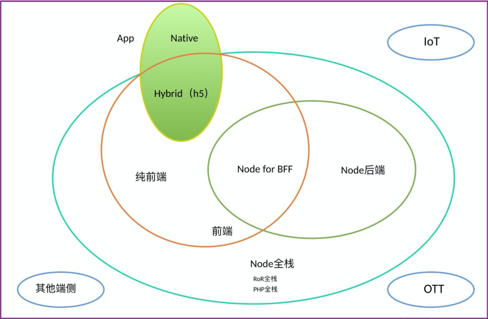

# 大前端

## 什么是大前端

简单来说，大前端就是所有前端的统称，比如 Web、Android、iOS、TV、智能穿戴设备等，最接近用户的那一层也就是 UI 层，然后将其统一起来，就是大前端

## 为什么要做大前端

## 如何成为大前端

掌握跨端技术开发

**Web 端**

- 标准
  - html
  - css
  - js（ECMA+DOM+BOM）
- 框架
  - React
  - Vue
  - Angular
  - Svelte
- 工程化
  - 各类脚手架
  - 低代码方案
  - CI/CD
  - 监控预警

**移动端**

- **_原生开发_**

  传统的原生 App 开发模式，有 iOS 和 aOS 两大系统，需要各自语言开发各自 App。
  优点：性能和体验都是最好的。
  缺点：开发和发布成本高。
  应用技术：Swift/OC，Java/kotlin。

- **_PWA_**

  移动端的网站，常被称为 H5 应用，说白了就是特定运行在移动端浏览器上的网站应用。
  优点：开发和发布成本最低。
  缺点：性能和体验不能讲是最差的，但也受到浏览器处理能力的限制，多次下载同样会占用用户一定的流量。
  应用技术：ReactJS，RegularJS，VueJS 等等。

- **_hybrid_**

  混合模式移动应用，介于 Web App、Native App 这两者之间的 App 开发技术，兼具"Native App 良好交互体验的优势"和"Web App 跨平台开发的优势"。
  主要的原理是，由 Native 通过 JSBridge 等方法提供统一的 API，然后用 Html+Css 实现界面，JS 来写逻辑，调用 API，最终的页面在 Webview 中显示，这种模式下，Android、iOS 的 API 一般有一致性，Hybrid App 所以有跨平台效果。

  优点：开发和发布都比较方便，效率介于 Native App、Web App 之间。
  缺点：学习范围较广，需要原生配合。
  举个栗子：东方航空 App，富国基金-富国钱包 App
  应用技术：Cordova，Ionic，APICloud，小程序。

- **_JavaScript 开发+原生渲染_**

  **RN**
  Facebook 发现 Hybrid App 存在很多缺陷和不足，于是发起开源的一套新的 App 开发方案 RN。使用 JSX 语言写原生界面，js 通过 JSBridge 调用原生 API 渲染 UI 交互通信。
  举个栗子：Facebook、Youtube
  **WEEX**
  阿里巴巴开发团队在 RN 的成功案例上，重新设计出的一套开发模式，站在了巨人肩膀上并有淘宝团队项目做养料，广受关注，2016 年 4 月正式开源，并在 v2.0 版本官方支持 Vue.js，与 RN 分庭抗礼。
  举个栗子：淘宝、天猫、阿里云、优酷、饿了么等.

  优点：效率体验接近 Native App，发布和开发成本低于 Native App。
  缺点：有一定学习成本，开发人员需要具备原生（Android、iOS）基础开发能力

- 自绘 UI+原生

  **Flutter**
  Flutter 是 Google 开源的构建用户界面（UI）工具包，帮助开发者通过一套代码库高效构建多平台精美应用，支持移动、Web、桌面和嵌入式平台
  优点：最接近原生性能
  缺点：脱离不开原生，开发人员需要具备原生（Android、iOS）基础开发能力
  举个栗子：闲鱼

**PC 端**

- **_CEF(Chromium Embedded Framwork)_**
  举个栗子：qq，LOL 游戏大厅
- **_NW.js_**
  举个栗子：微信 web 开发工具，钉钉
- **_Electron_**
  举个栗子：Vscode，Atom，Github
  是一个能让你使用 JavaScript, HTML 和 CSS 来创建桌面应用程序的框架。 这些应用程序可以打包后在 macOS、Windows 和 Linux 上直接运行，或者通过 Mac App Store 或微软商店进行分发。
  Chromium + Node.js + Native APIs

  优点：界面定制性强，原则上只要是 Web 能做的他都能做，方便热更新
  缺点：卡，启动慢，打出来的包太大

**TV 端**

TV 端开发规范和逻辑与手机端 APP 属于一脉，一般由 Android 系统做底层支持，由 APP 开发人员开发不同类型软件应用。在 TV 端所有基本操作均依赖“遥控器”进行操作，这也就决定了其人机交互与其它端存在本质差异，所以与移动端开发技术差异不大

举个栗子：智能电视上面的 app

**_IOT 端_**

- IOT.js
  IoT.js 就是一款让你可以在内存和存储都非常局限的设备上，仍然可以使用 Node.js 编程的一款运行时，为什么不直接使用 Node.js 呢？因为 Node.js 本身基于 v8 构建，v8 无论在启动时还是运行时做的优化，都让一个 Node.js 进程在设备端变得无比庞大。通常一个进程就需要 6-7M，这些在物联网场景都是不可接受的。IoT.js 替换了 JavaScript 引擎为 JerryScript，一个裸 VM 启动后，仅需要不到 100KB 的内存，加上上层 IoT.js 的接口实现，也不到 500KB，但是这个不支持 jit，所以运行速度可能比不上 Node.js
- Huawei LiteOS/HarmonyOS
  华为研发的用于物联网设备的操作系统，采用 JavaScript 作为应用开发语言，引擎也是 JerryScript
